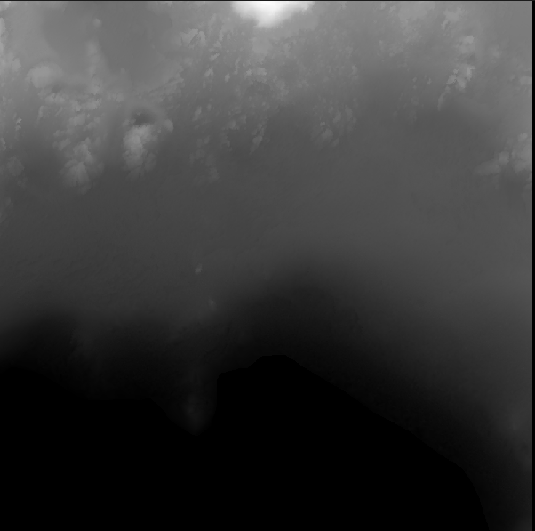
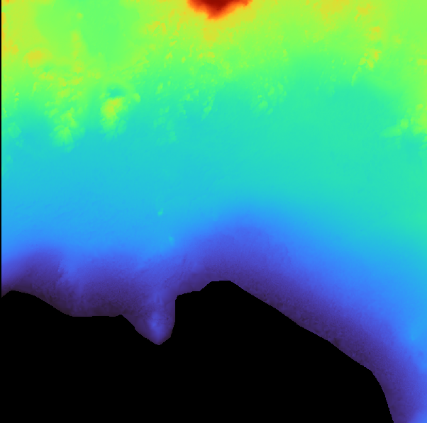
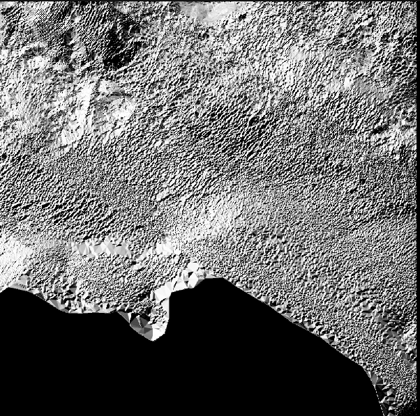
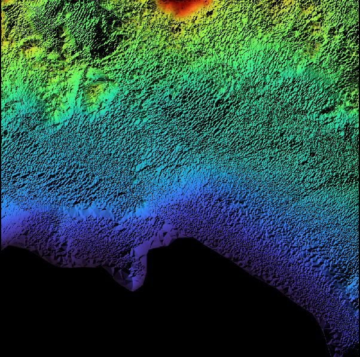

# Rust-based DEM Viewer

A terminal-based Digital Elevation Model (DEM) viewer that supports grayscale, color gradient, hillshade, and colored hillshade rendering of `.asc` files.

## Developers

- Shahid Ahamed Hasib
- Mohamed Magdy Atta

## A cool feature to add to the program : CLI User Interaction

This Rust application visualizes Digital Elevation Model (DEM) data from `.asc` files, using command-line arguments to specify the input file and visualization mode. The `clap` crate manages these arguments, allowing users to select modes like `grayscale`, `color`, `hillshade`, or `color+hillshade` directly from the terminal. The `Args` struct defines the command-line arguments, which are parsed in the `main` function using `Args::parse()`. The application then reads the DEM data and applies the selected visualization mode, enhancing flexibility and ease of use.

## Dataset used

The Litto3D is a SHOM (French Hydrographic Institute) open dataset of very accurate bathymetric data of the Eastern French Mediterranean coast.

All this dataset is downloadable here :
 https://diffusion.shom.fr/multiproduct/product/configure/id/136


## Main Features

- Opens and parses `.asc` DEM files.
- Displays DEM in:
  - Grayscale
  - Color (Turbo colormap)
  - Hillshade (simulated sunlight shading)
  - Color + Hillshade (enhanced terrain visualization)

## Running the Program

### General Syntax

```bash
cargo run -- <path-to-asc-file> --mode <grayscale | color | hillshade | color+hillshade>
```

### Example

```bash
cargo run -- "/0925_6225/LITTO3D_FRA_0925_6224_...asc" --mode color+hillshade
```

## Results of DEM Visualizations

<div align="center">

<p>Grayscale DEM</p>
</div>

<div align="center">

<p>Colored DEM</p>
</div>

<div align="center">

<p>Grayscale Hillshaded DEM</p>
</div>

<div align="center">

<p>Colored Hillshaded DEM</p>
</div>
